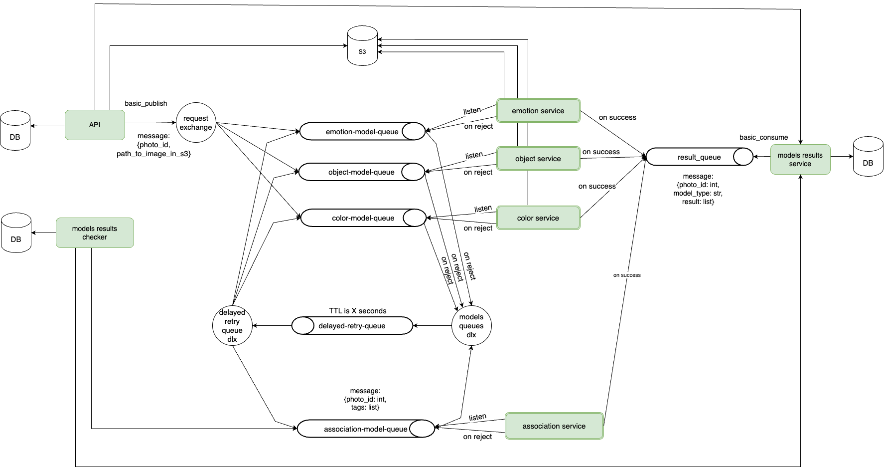

# picachu-api

## Description
A project to determine the uniqueness of a photo by its components. API application.


## Local development

### Prerequisites

1. `python` [Any release](https://www.python.org/downloads). Version `>=3.8` is priority.
2. `pip` installed with actual version. Here is command to update `pip`:
  ```bash
  python -m pip install --upgrade pip
  ```
3. `poetry` installed globally (execute **only** from non-project terminal)
  ```
  pip install poetry
  ```

4. `gitlint` installed globally (execute **only** from non-project terminal)
  ```
  pip install gitlint
  ```
  Once you installed `gitlint` and pulled the src execute the following command to turn on the commit messages validation from the project root
  ```
  gitlint install-hook
  ```

5. `make`
  - ***Linux:*** `make` should be installed automatically.
  - ***MacOS:*** `make` should be installed automatically.
  - ***Windows:***
    on Windows install using chocolatey (if you use git bash cmd it should be run as Administrator)
    ```bash
    choco install make
    ```
- [PyCharm Community](https://www.jetbrains.com/pycharm/download/)

### Configure PyCharm for the project

Firstly you need to install the dependencies locally to have code helpers active in the IDE
```bash
make install-local-deps
```

Then you need to select Python interpreter from Poetry:
- open the project in PyCharm
- go to File -> Settings -> Project -> Python interpreter
- click on the gear icon to open the python interpreter settings -> Add
- select Pipenv Environment
- if all needed things have been installed correctly both `Base interpreter` and `Pipenv executable` should be filled
- click Ok

### How to run locally

#### Port Map

| Service                   | Port | Description      |
|---------------------------|------|------------------|
| picachu-api               | 7501 |                  |
| picachu-api-postgres      | 7510 |                  |
| picachu-api-s3            | 7511 | REST             |
| picachu-api-s3            | 7512 | minio-UI         |
| picachu-api-rabbitmq      | 7513 | rabbitmq (5672)  |
| picachu-api-rabbitmq      | 7514 | rabbitmq (15672) |

The main idea is to run project in the docker container to be able to run this project on the different OSs (Win, Linux, Mac). This was done in case of **differences** in the `poetry.lock` on the different OSs.

- to run the api locally execute

The main idea is to run project in the docker container to be able to run this project on the different OSs (Win, Linux, Mac). This was done in case of **differences** in the `poetry.lock` on the different OSs.

- to run the api locally execute
  ```bash
  make run
  ```
#### Services schema


#### How to access services

- **PicachuApi**:  you should be able to access API at http://localhost:7501

### Linting

#### Prerequisites
Before using linting, you should install local dependencies (this was described above). 
```bash
make install-local-deps
```

#### Pylint
The **pylint** packages installed in the Pipfile help you analyze different areas of the code.
The *rules* for  Pylint code analysis are described in the `.pylintrc` file.
 
Project linting will be triggered **at every merge request event** in the gitlab ci.

#### HowTo
During project development, you can use linting in two ways:
1) Use the terminal:
  ```bash
  make lint
  ```

2) Use the `pylint` [plugin](https://plugins.jetbrains.com/plugin/11084-pylint) for the Pycharm:

  In `File` -> `Settings` -> `Plugins` you should install a Pylint plugin and apply it.
  The Pylint plugin will appear in PyCharm next to the terminal. In it, you can select the errors you are interested in 
  and click on Check Project on the left side of the window.

  Also you need to setup this arguments to Pylint plugin in `File` -> `Settings` -> `Pylint` -> `Arguments`:
  
  ```bash
  --load-plugins pylint_flask --load-plugins pylint_flask_sqlalchemy --generated-members=Column
  ```

  These arguments help us to correctly process Flask and SQLAlchemy components in project.

### Conventional Commits

[Conventional commits](https://www.conventionalcommits.org/en/v1.0.0/) convention is enforced to be used by `gitlint` python package which has to be installed globally.


## PyCharm

### Settings Syncing via git repo

To use TourmalineCore shared PyCharm settings, you need:
1. To clone the [repository](https://gitlab.com/tourmalinecore/infrastructure/pycharm-settings) where the settings stored
2. Then you can import these settings via `File` -> `Manage IDE Settings` -> `Import Settings...`